# Earflow Architecture Map

Полная карта проекта Earflow: публичные продукты, домены, frontend-слои, Nginx, gateway, backend-сервисы, хранилища, realtime, streaming и основные data flows.

> **Визуальная версия:** открой `docs/earflow-architecture-visual.html` в браузере. Это отдельная интерактивная HTML-карта с тёмным UI, карточками слоёв и Mermaid-диаграммами.

## Источники истины

- **Deployment:** `docker-compose.yml`, `docker-compose.monitoring.yml`, `docker-compose.pgbouncer.yml`, `docker-compose.tools.yml`.
- **Edge / reverse proxy:** `nginx/nginx.conf`, `nginx/conf.d/*.conf`.
- **Gateway routes:** `backend/go-api-gateway/gateway.yaml`, `backend/go-api-gateway/gateway.artist.yaml`, `backend/go-api-gateway/internal/config/config.go`.
- **Main frontend:** `frontend/src/index.js`, `frontend/src/App.js`, `frontend/src/api/client.js`, `frontend/src/context/PlayerContext`, `frontend/src/playback`, `frontend/src/player-core`.
- **Artist frontend:** `artist-frontend/src/App.js`, `artist-frontend/src/state/auth/AuthContext.js`, `artist-frontend/src/transport/*`.
- **Backend services:** service folders under `backend/`, matched against active compose services.

## Карта 0: Big Picture

```mermaid
flowchart TB
    user["Listener Browser / PWA"]
    artist_user["Artist Browser"]
    admin_user["Operator via SSH tunnel"]

    subgraph public_domains["Public HTTPS domains"]
        earflow["earflow.ru\nMain listener SPA"]
        auth_domain["auth.earflow.ru\nLogin-only SPA"]
        api_domain["api.earflow.ru\nAPI + WS + HLS"]
        artists_domain["artists.earflow.ru\nArtist Portal SPA"]
        stream_domain["strmhaha.earflow.ru\nDirect audio origin"]
    end

    subgraph edge["Edge layer"]
        nginx["nginx\nTLS, CSP, CORS, rate limits, static/media cache"]
    end

    subgraph frontends["Frontend containers"]
        frontend["frontend:3004\nReact listener/auth SPA"]
        artist_frontend["artist-frontend:3005\nReact Artist Portal SPA"]
    end

    subgraph gateways["Gateway layer"]
        api_gateway["api-gateway:3000\nGo main gateway"]
        artist_api_gateway["artist-api-gateway:3000\nGo artist gateway"]
    end

    subgraph backend["Internal backend services"]
        auth_service["auth-service"]
        security_service["security-service"]
        database_service["database-service"]
        upload_service["upload-service"]
        artist_service["artist-service"]
        artist_portal_service["artist-portal-service"]
        direct_stream_service["direct-stream-service"]
        ebap_hls_adapter["ebap-hls-adapter"]
        playlist_service["playlist-service"]
        recommendations_service["recommendations-service"]
        search_service["search-service"]
        lyrics_service["lyrics-service"]
        party_state["party-state-service"]
        party_gateway["party-gateway-service"]
        device_sync["device-sync-service"]
    end

    subgraph data["Data / cache / bus / object storage"]
        postgres["Postgres + pgvector"]
        redis["Redis main"]
        redis_auth["Redis auth/session"]
        minio["MinIO S3"]
        meili["Meilisearch"]
        nats["NATS JetStream"]
    end

    user --> earflow --> nginx
    user --> auth_domain --> nginx
    user --> api_domain --> nginx
    user --> stream_domain --> nginx
    artist_user --> artists_domain --> nginx
    admin_user --> nginx

    nginx --> frontend
    nginx --> artist_frontend
    nginx --> api_gateway
    nginx --> artist_api_gateway
    nginx --> upload_service
    nginx --> direct_stream_service
    nginx --> ebap_hls_adapter
    nginx --> minio

    api_gateway --> auth_service
    api_gateway --> security_service
    api_gateway --> database_service
    api_gateway --> upload_service
    api_gateway --> artist_service
    api_gateway --> direct_stream_service
    api_gateway --> ebap_hls_adapter
    api_gateway --> playlist_service
    api_gateway --> recommendations_service
    api_gateway --> search_service
    api_gateway --> lyrics_service
    api_gateway --> party_state
    api_gateway --> party_gateway
    api_gateway --> device_sync

    artist_api_gateway --> auth_service
    artist_api_gateway --> security_service
    artist_api_gateway --> artist_service
    artist_api_gateway --> artist_portal_service
    artist_api_gateway --> database_service

    backend --> postgres
    backend --> redis
    auth_service --> redis_auth
    security_service --> redis_auth
    direct_stream_service --> minio
    upload_service --> minio
    ebap_hls_adapter --> minio
    search_service --> meili
    party_state --> nats
    party_gateway --> nats
```

## Карта 1: публичные продукты

| Продукт | Публичная точка входа | Frontend | Backend boundary | Основные возможности |
|---|---|---|---|---|
| Listener Platform | `https://earflow.ru` | `frontend` | `api-gateway` | Каталог, поиск, плеер, рекомендации, профили, плейлисты, подписки, lyrics, Party, Device Sync, PWA/offline shell |
| Auth UI | `https://auth.earflow.ru` | тот же `frontend` | `api-gateway` → `auth-service` | Login/register/reset, Telegram auth, refresh/profile, возврат на main domain |
| Public API | `https://api.earflow.ru` | external API surface | `api-gateway` | `/api/*`, `/ws/*`, `/api/stream/v2`, `/api/ebap-hls/*` |
| Direct streaming origin | `https://strmhaha.earflow.ru` | audio element / playback connector | `direct-stream-service` | `/audio/v1/*` Range streaming, signed/session-based direct audio |
| Artist Portal | `https://artists.earflow.ru` | `artist-frontend` | `artist-api-gateway` → `artist-portal-service` | Artist onboarding, claim/admin review, card management, tracks/assets upload, MFA/security |
| Admin / Ops | localhost-only via SSH tunnel | browser tools | Nginx localhost locations + tool containers | Gateway admin/metrics, Portainer, pgAdmin, Grafana, Prometheus, Loki, Tempo |

## Карта 2: Nginx edge routing

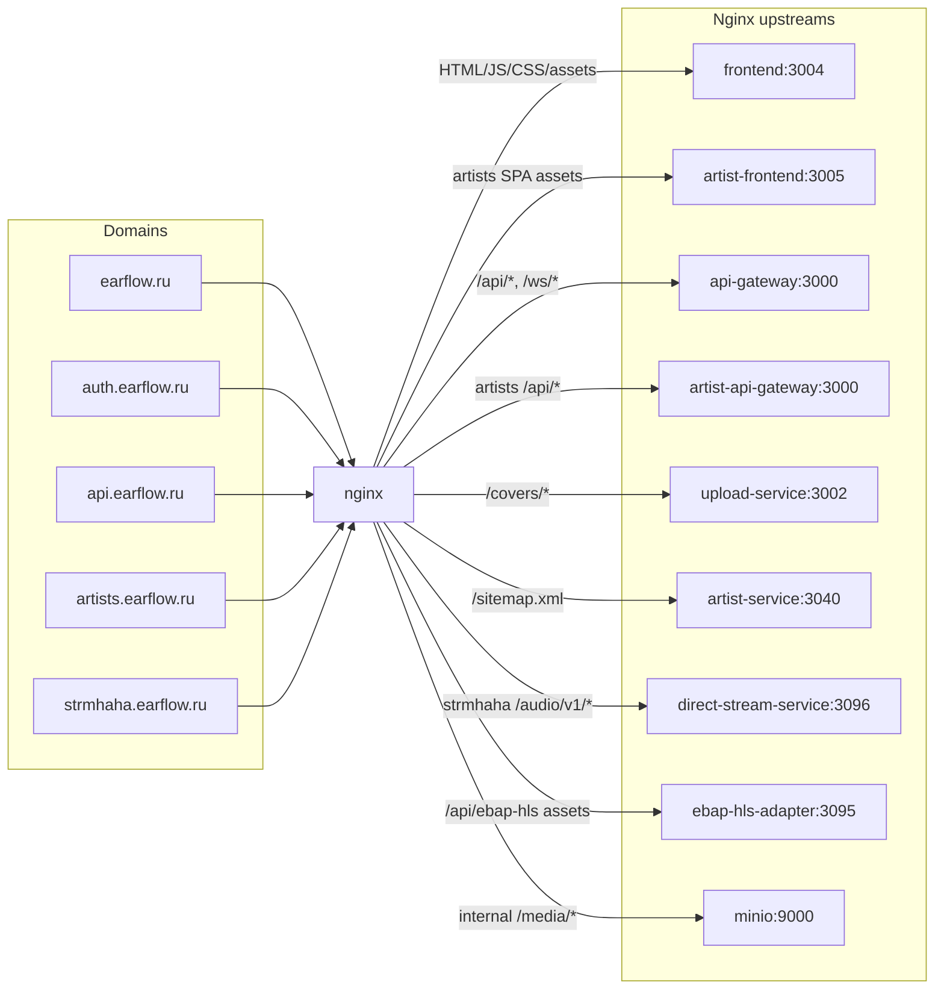

### Nginx responsibilities

- **TLS:** all public HTTPS hosts use `earflow.ru` certificate.
- **Security headers:** HSTS, CSP, `X-Frame-Options`, `X-Content-Type-Options`, Referrer Policy, Permissions Policy.
- **CORS:** origin-aware CORS for `earflow.ru` and `artists.earflow.ru`; credentials enabled where cookies are required.
- **Rate limits:** shared zones for API, auth, upload, HLS, media and connection limits.
- **Static cache:** immutable JS/CSS/fonts/images via `static_cache`.
- **Audio cache:** direct audio internal MinIO locations use `audio_cache`/`ebap_cache`; browser-facing Range semantics stay service-controlled.
- **Admin exposure:** `/admin`, `/metrics`, `/health` on public API are localhost-only; port `8085` is internal/tunnel-focused.
- **Legacy EBAP v3:** `/api/ebap/v3/*` and `/api/ebap/v3/chunk/*` return `410`; live iOS/HLS path is `/api/ebap-hls/*`.

## Карта 3: Gateway routing

### Main Go API Gateway

```mermaid
flowchart TB
    client["Browser / frontend apiClient"] --> gw["api-gateway"]

    gw -- "/api/auth, /api/verify, /api/profile" --> auth["auth-service"]
    gw -- "/api/songs, /api/user, /api/songs/search" --> db["database-service"]
    gw -- "/api/upload/user/avatar, /covers, /api/likes, /api/dislikes, /api/eq" --> upload["upload-service"]
    gw -- "/api/artists, /api/albums" --> artist["artist-service"]
    gw -- "/api/playlists, /api/queue, /api/mix" --> playlist["playlist-service"]
    gw -- "/api/subscriptions" --> subscription["subscription-service"]
    gw -- "/api/recommendations" --> reco["recommendations-service"]
    gw -- "/api/search/v1" --> search["search-service"]
    gw -- "/api/lyrics" --> lyrics["lyrics-service"]
    gw -- "/api/metadata" --> metadata["metadata-parser-service"]
    gw -- "/api/import" --> import_svc["import-service"]
    gw -- "/api/stream/v2" --> direct["direct-stream-service"]
    gw -- "/api/ebap-hls" --> hls["ebap-hls-adapter"]
    gw -- "/api/party" --> party_state["party-state-service"]
    gw -- "/ws/v2" --> party_ws["party-gateway-service"]
    gw -- "/api/devices, /ws/devices" --> device["device-sync-service"]
```

| Route group | Upstream | Auth/security intent |
|---|---|---|
| `/api/auth`, `/api/verify`, `/api/profile` | `auth-service` | Session/profile/auth lifecycle |
| `/api/songs`, `/api/songs/recommendations`, `/api/songs/search`, `/api/user` | `database-service` | Public catalog plus user-scoped routes |
| `/api/upload`, `/covers`, `/api/likes`, `/api/dislikes`, `/api/eq` | `upload-service` | Upload/media/profile assets and user music actions |
| `/api/artists`, `/api/albums` | `artist-service` | Public artist/album catalog |
| `/api/playlists`, `/api/queue`, `/api/mix` | `playlist-service` | Playlists, public shares, queue and mix product |
| `/api/subscriptions` | `subscription-service` | Subscription plans and protected user subscription state |
| `/api/recommendations` | `recommendations-service` | Recommendation API and feedback path |
| `/api/search/v1` | `search-service` | Meilisearch-backed search with fallback |
| `/api/lyrics` | `lyrics-service` | Lyrics search/import/serve |
| `/api/metadata` | `metadata-parser-service` | Metadata parsing endpoints |
| `/api/import` | `import-service` | Import/enrichment endpoints |
| `/api/stream/v2` | `direct-stream-service` | Direct streaming session and encrypted/protected audio routes |
| `/api/ebap-hls` | `ebap-hls-adapter` | HLS/iOS streaming path |
| `/api/party`, `/ws/v2` | `party-state-service`, `party-gateway-service` | Party REST and WebSocket |
| `/api/devices`, `/ws/devices` | `device-sync-service` | Device registry, transfer, nowPlaying, WebSocket |

### Artist Go API Gateway

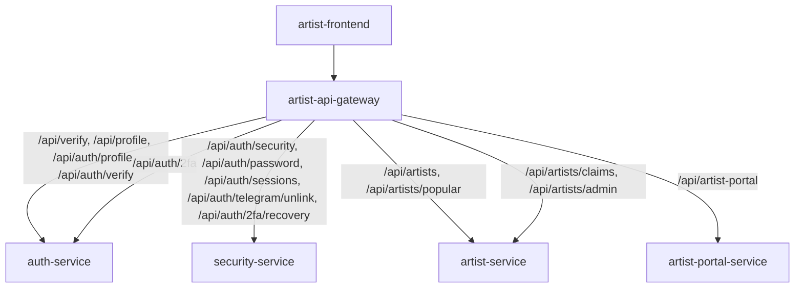

| Route group | Upstream | Main purpose |
|---|---|---|
| `/api/artist-portal/*` | `artist-portal-service` | Artist Portal BFF: profile/card/tracks/assets |
| `/api/artists/claims` | `artist-service` | Artist claim submit/list |
| `/api/artists/admin` | `artist-service` | Artist claim moderation/admin operations |
| `/api/auth/2fa`, `/api/profile`, `/api/verify` | `auth-service` | Auth profile, verify, base MFA routes |
| `/api/auth/security`, `/api/auth/password`, `/api/auth/sessions`, `/api/auth/telegram/unlink`, `/api/auth/2fa/recovery` | `security-service` | Account security hot-path operations |

## Карта 4: Docker services by domain

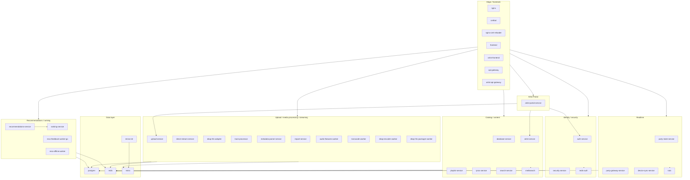

## Карта 5: service inventory

### Edge, frontends and gateways

| Service | Port/exposure | Role | Talks to |
|---|---:|---|---|
| `nginx` | public `80/443`, local `8443/8085` | Edge load balancer, TLS, CORS/CSP, static/media caches, API/WS/audio reverse proxy | `frontend`, `artist-frontend`, `api-gateway`, `artist-api-gateway`, `upload-service`, `artist-service`, `direct-stream-service`, `ebap-hls-adapter`, `minio` |
| `frontend` | internal `3004` | Main React SPA and auth-domain SPA; PWA shell | Browser; API calls through Nginx to gateway/streaming surfaces |
| `artist-frontend` | internal `3005` | Artist Portal React SPA | `artist-api-gateway` via `/api/*` |
| `api-gateway` | internal `3000`, scalable replicas | Main Go API gateway, route policies, sessions, CSRF, service-token propagation, rate limits, admin/metrics | Backend services, `redis`, `redis-auth` |
| `artist-api-gateway` | internal `3000` | Isolated artist gateway with artist cookie/session namespace | `auth-service`, `security-service`, `artist-service`, `artist-portal-service`, `database-service`, Redis |
| `certbot` | no public app port | Certificate renewer | `/etc/letsencrypt`, Nginx ACME webroot |
| `nginx-cert-reloader` | no public app port | Watches cert changes and reloads Nginx | Nginx pid namespace |

### Identity and security

| Service | Port | Role | Data/dependencies |
|---|---:|---|---|
| `auth-service` | `3001` | Email/Telegram auth, profile, verify, refresh/logout, base 2FA routes | `database-service`, `redis-auth`, service key |
| `security-service` | `3074` | Account security hot-path: overview, password, sessions, Telegram unlink, recovery regeneration, step-up state | Direct `postgres`, `redis-auth` |
| `redis-auth` | internal `6379` | Dedicated session/security Redis with `noeviction` | Main and artist session stores, step-up, security state |

### Catalog, library and social data

| Service | Port | Role | Data/dependencies |
|---|---:|---|---|
| `database-service` | `3003` | Catalog/user/song APIs behind gateway; service-token issuing/validation; DB abstraction for selected workers | `postgres`; service keys for allowed internal services |
| `artist-service` | `3040` | Public artists/albums, artist claims/admin, sitemap, artist ownership/profile records | `postgres`, `auth-service` |
| `playlist-service` | `3020` | Playlists, queue, discover, mix routes | `postgres`, `redis`; active playlist join table is `playlist_tracks` |
| `subscription-service` | `3010` | Subscription plans and user subscription state | `postgres` |
| `lyrics-service` | `3010` | Lyrics search/import/serving; internal access for HLS lyrics payloads | `postgres`; service-token accepted from gateway and HLS adapter |
| `search-service` | `3062` | Search API backed by Meilisearch with Postgres fallback/indexing | `postgres`, `meilisearch` |
| `meilisearch` | internal `7700` | Search index | Persistent `meilisearch-data` volume |

### Upload, import, metadata and media processing

| Service | Port | Role | Data/dependencies |
|---|---:|---|---|
| `upload-service` | `3002` | Song upload, covers, user avatars, likes/dislikes/EQ endpoints, upload-side DB writes | `auth-service`, direct `postgres`, `minio`, upload volume |
| `track-processor` | health internal | Scans mounted library and imports/compresses covers/audio | `database-service`, `minio`, read-only music source mount |
| `metadata-parser-service` | `3072` | ID3/tag extraction for uploaded audio | direct `postgres`, `minio` |
| `import-service` | `3073` | MusicBrainz/Spotify metadata enrichment | direct `postgres`, external metadata APIs if credentials configured |
| `audio-features-worker` | `3051` health | Computes audio features from stored tracks | `database-service`, `minio` |
| `transcode-worker` | `3098` health | Multi-quality audio variants and loudness metadata | direct `postgres`, `minio`, ffmpeg work dir |
| `ebap-encoder-worker` | `3091` health | Generates EBAP chunk manifests into `ebap-cache` | direct `postgres`, `minio` |
| `ebap-hls-packager-worker` | `3092` health | Prepackages HLS VOD assets into `ebap-hls` | direct `postgres`, `minio` |

### Streaming

| Service | Port | Role | Data/dependencies |
|---|---:|---|---|
| `direct-stream-service` | `3096` | Direct/progressive streaming session API, signed URLs, Range serving, quality variant selection | direct `postgres`, `minio`, `redis` session cache |
| `ebap-hls-adapter` | `3095` | HLS adapter for iOS/WebKit path, HLS session, lyrics binary, token/cookie validation | `lyrics-service`, `database-service` service-token endpoint, `redis`, `minio`, ffmpeg |
| `minio` | local-only host `9000/9001`, internal `9000` | Object storage for audio/covers/EBAP/HLS artifacts | `minio-data` volume |
| `minio-init` | one-shot | Creates/initializes buckets | `minio` |

### Realtime and sync

| Service | Port | Role | Data/dependencies |
|---|---:|---|---|
| `party-state-service` | `3130` | Party v2 REST state, invites, sessions, playback state | `redis` DB2, `nats` |
| `party-gateway-service` | `3131` | Party v2 WebSocket gateway | `nats`, WS token secret |
| `device-sync-service` | `3050` | Device registry, nowPlaying ownership, commands, WS | `redis` DB3, `auth-service`; feature-gated by `DEVICE_SYNC_ENABLED` |
| `nats` | `4222`, monitor `8222` internal | Party v2 event bus / JetStream | `party-state-service`, `party-gateway-service` |

### Recommendations and ranking

| Service | Port | Role | Data/dependencies |
|---|---:|---|---|
| `recommendations-service` | `3006` | Recommendation API, session security, cache, migrations, feedback endpoints | `postgres`, `redis`, `auth-service`, `ranking-service` |
| `ranking-service` | `8080` | Ranking/scoring HTTP service | Called by `recommendations-service` |
| `reco-feedback-worker-go` | `3016` health | Redis Stream consumer for feedback aggregation | `redis`, `postgres` |
| `reco-offline-worker` | `3017` health | Periodic offline SQL-based recommendation generation | `postgres`, `redis` |
| `reco-feedback-loadgen` | profile `tools` | Load generator for feedback stream | `redis`, `postgres`, feedback worker |

### Tools, tests and optional infrastructure

| Service/file | Role | Exposure |
|---|---|---|
| `upload-service-tests` | Upload integration tests profile | internal, command-only |
| `integration-tests` | Backend integration test suite profile | internal, command-only |
| `portainer` | Docker management UI | `127.0.0.1:9002`, `127.0.0.1:9443` only |
| `pgadmin` | PostgreSQL management UI, profile `tools` | `127.0.0.1:5050` only |
| `docker-compose.monitoring.yml` | Current monitoring stack | Prometheus, Loki, Tempo, Alloy, cAdvisor, Node Exporter, Blackbox, Grafana; localhost-only ports |
| `docker-compose.tools.yml` | Legacy/tools monitoring variant | Prometheus/Loki/Promtail/exporters/Grafana; localhost-only ports |
| `docker-compose.pgbouncer.yml` | Optional PgBouncer overlay | Adds `pgbouncer:6432` and rewires selected services to pooled DB connections |
| `backend/ebap-streaming-service` | Legacy EBAP v3 codebase folder | Not active in current `docker-compose.yml`; `/api/ebap/v3/*` returns `410` at Nginx |

## Карта 6: data stores and ownership

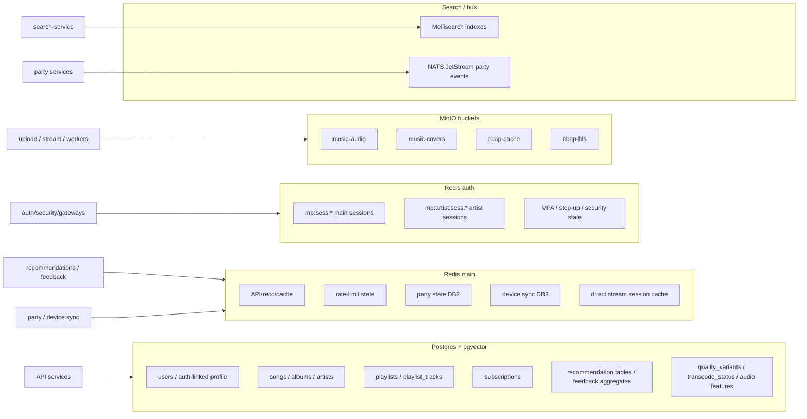

### Data notes

- **Postgres is the system of record:** catalog, user-linked data, artists, playlists, subscriptions, recommendation metadata and media/transcode metadata.
- **Redis main:** cache/rate-limit/recommendation/realtime/session-like feature state with service-specific TTLs.
- **Redis auth:** separate auth/security Redis with `noeviction`; session/security state must not be evicted under memory pressure.
- **MinIO:** binary assets and streaming artifacts; public access is mediated by Nginx, upload service, signed URLs, cookies or service tokens.
- **Meilisearch:** search index, not source of truth; `search-service` can fall back to Postgres.
- **NATS JetStream:** Party v2 event bus between state and WebSocket gateways.

## Карта 7: main frontend architecture

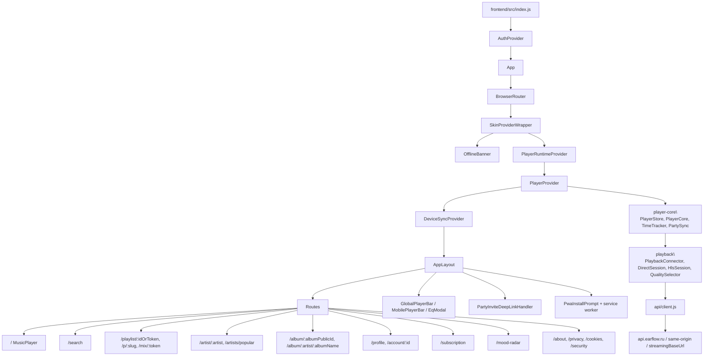

### Main frontend route behavior

- **Auth domain short-circuit:** on `auth.earflow.ru`, `PlayerRuntimeProvider` is skipped and only `AuthStandalonePage` routes are active.
- **Listener app:** on `earflow.ru`, authenticated users mount `PlayerProvider`, `DeviceSyncProvider`, player bars, PWA prompt and Party invite deep-link handling.
- **Offline:** `OfflineProvider` is mounted only for profile/account routes, not globally.
- **Playback:** playback state is centralized in `PlayerContext` + `player-core`; UI components subscribe/present state.
- **Streaming config:** `apiClient` uses runtime `API_BASE_URL` and `STREAMING_BASE_URL`.
- **Device Sync:** frontend provider is present under player runtime; backend can disable the feature with `DEVICE_SYNC_ENABLED`.

## Карта 8: Artist Portal frontend architecture

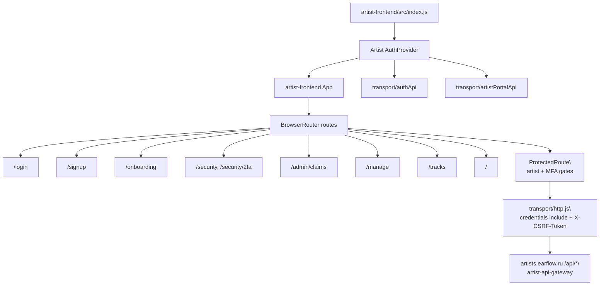

### Artist Portal rules at frontend boundary

- **Session bootstrap:** `AuthProvider` calls `authApi.profile()` then `artistPortalApi.me()`.
- **Artist gate:** non-artist users are redirected to onboarding unless the route explicitly allows non-artist state.
- **MFA gate:** artist users without enabled MFA are redirected to `/security/2fa` for protected routes.
- **CSRF:** unsafe methods attach `X-CSRF-Token` from `mp_csrf_artists` by default, with fallback to `mp_csrf`.
- **Credentials:** all portal transport calls use `credentials: include` and `cache: no-store`.

## Карта 9: Auth/session/CSRF flow

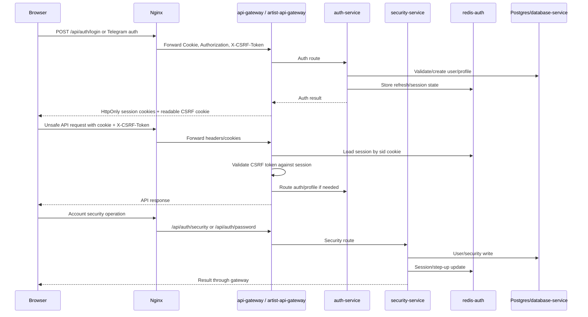

### Auth/security invariants

- **Main cookies:** main gateway uses the main session/CSRF namespace, including `mp_sid` and `mp_csrf` patterns.
- **Artist cookies:** artist gateway uses isolated artist session/CSRF names, including `mp_sid_artists` and `mp_csrf_artists` patterns.
- **CSRF model:** unsafe requests must provide `X-CSRF-Token` matching the CSRF cookie/session expectation.
- **Session storage:** sessions live in `redis-auth`; `redis-auth` is configured for no-eviction behavior.
- **Header trust:** gateways are responsible for overwriting spoofable identity headers before forwarding downstream context.
- **Step-up:** sensitive artist writes and account security flows rely on MFA/step-up state through auth/security services.

## Карта 10: Direct streaming flow

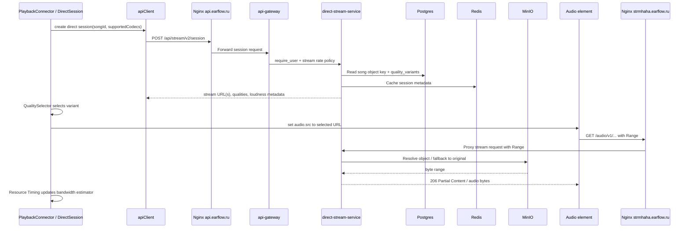

### Direct streaming notes

- **Range semantics:** browser controls Range request sizes; server keeps RFC-compliant Range behavior.
- **ABR:** frontend sends supported codecs and selects variants via `QualitySelector`; direct stream filters variants by supported codecs when available.
- **Variants:** `transcode-worker` stores variants and loudness metadata in `songs.quality_variants`.
- **Session cache:** `direct-stream-service` uses Redis for session cache and Postgres for authoritative media metadata.
- **Origins:** production frontend uses `api.earflow.ru` for session APIs and `strmhaha.earflow.ru` for direct audio origin when configured.

## Карта 11: iOS / HLS / EBAP-HLS flow

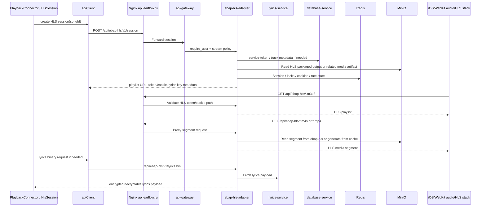

### EBAP/HLS notes

- **Live path:** `ebap-hls-adapter`, `ebap-encoder-worker`, `ebap-hls-packager-worker`, `ebap-cache` and `ebap-hls` buckets are active for HLS.
- **Dead path:** EBAP v3 chunk streaming is deprecated at Nginx with `410` and is not active through compose.
- **Security:** HLS playlist/assets use cookie/token controls, CORS restrictions, fetch navigation guards and no-store headers for session-sensitive responses.

## Карта 12: Upload → metadata → transcode → stream availability

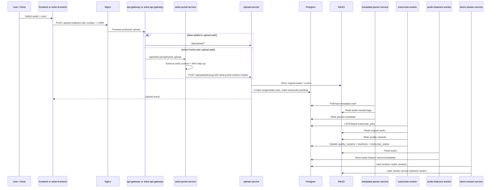

### Upload and processing notes

- **Artist Portal writes:** routed through `artist-portal-service` as a BFF to enforce artist ownership/context and MFA step-up before using `upload-service`.
- **Artist Portal track upload buffering:** large audio files are accepted with disk-backed Multer storage in `artist-portal-service` and forwarded to `upload-service` from the temporary file; temp files are deleted after success or failure.
- **Upload context:** artist portal upload requests include an artist-portal upload context header when proxying to upload service.
- **MinIO buckets:** originals and variants live in audio bucket; covers/assets live in covers bucket; EBAP/HLS artifacts use dedicated buckets.
- **Transcode state:** song rows include transcode status/error and JSONB variant metadata.

## Карта 13: Artist Portal product flow

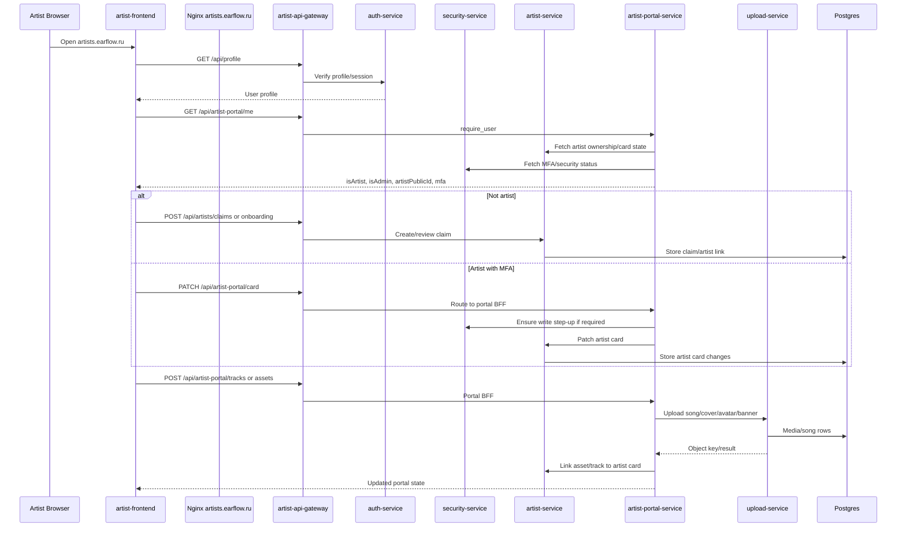

## Карта 14: Party Sync flow

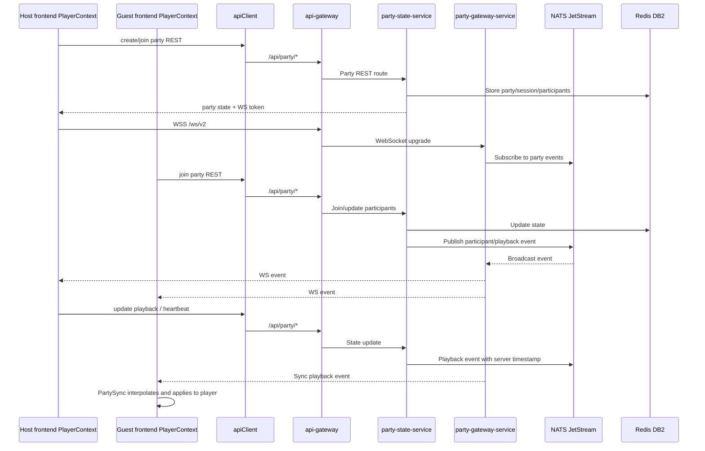

### Party frontend notes

- **Single connection owner:** `PlayerContext` owns active party state and one bridge/transport path.
- **State store:** `PartySync` is a vanilla TS store; `usePartySync` bridges it into React with `useSyncExternalStore`.
- **Transport hook:** `useParty` manages WS lifecycle and routes incoming messages to `PartySync`.
- **Sync engine:** `usePartyPlaybackBridge` sends host updates and applies guest playback state.

## Карта 15: Device Sync flow

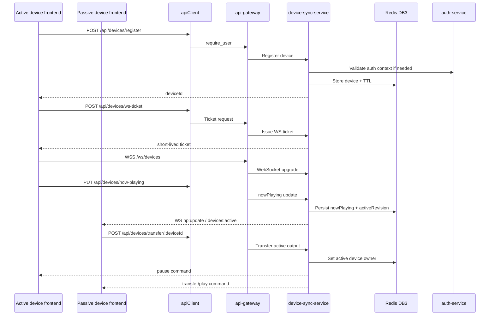

### Device Sync invariants

- **Server-authoritative owner:** backend registry owns the active output device and active revision.
- **Passive devices:** frontend keeps passive devices in silent shadow mode and routes controls through server transfer/commands.
- **Stale-event protection:** frontend ignores stale `activeRevision` and guards nowPlaying rollback via revisions/timestamps.
- **Feature flag:** backend can answer feature-disabled responses while frontend degrades to no-op when disabled.

## Карта 16: Search and recommendations

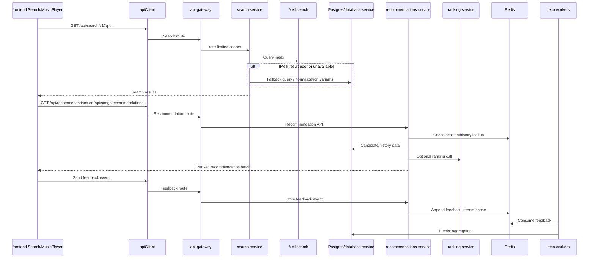

### Search/recommendation notes

- **Search index:** `search-service` can set up/backfill indexes and uses Postgres as source/fallback.
- **Recommendation cache:** `recommendations-service` uses Redis for sessions/cache and Postgres for durable data.
- **Offline worker:** `reco-offline-worker` periodically computes SQL-based user recommendations.
- **Feedback worker:** Go worker consumes feedback stream and writes aggregates.

## Карта 17: Lyrics flow

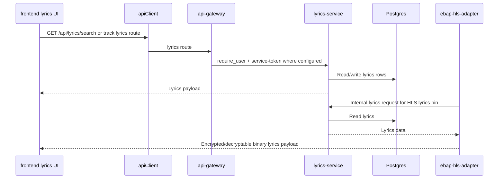

## Карта 18: Monitoring, admin and ops

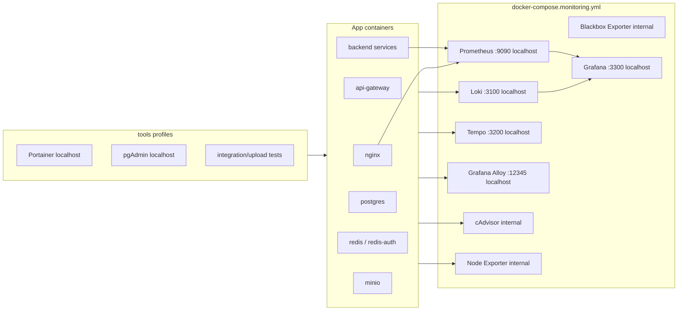

### Ops exposure rules

- **Prometheus/Loki/Tempo/Alloy/Grafana:** monitoring compose binds public UI ports to `127.0.0.1`.
- **Portainer/pgAdmin:** tools are localhost-only and should be accessed through SSH tunnel/VPN.
- **Gateway metrics/admin:** Nginx exposes sensitive paths only from localhost.
- **Docker socket:** mounted only for admin/observability tools that require it; this is high privilege and must remain local-only.

## Карта 19: Trust boundaries and security model

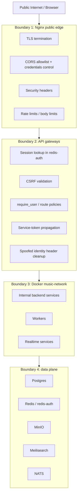

### Security checklist encoded in architecture

- **AuthN/AuthZ:** browsers never talk directly to internal services; gateway enforces route policy and user context.
- **CSRF:** cookie-based sessions require `X-CSRF-Token` on unsafe requests.
- **Secrets:** services use environment variables/secrets; no secret values should be copied into documentation.
- **Storage:** MinIO public access is not direct; Nginx/upload/streaming services mediate object access.
- **Realtime:** WS connections pass through gateway/Nginx and use short-lived tickets/tokens where configured.
- **Artist isolation:** artist portal has separate frontend, gateway session namespace and BFF service.
- **Rate limiting:** Nginx and gateways apply limits for auth, API, upload, HLS and media.
- **Legacy removal:** EBAP v3 is intentionally blocked with `410`, reducing stale attack surface.

## Карта 20: API surface by product

| Product surface | Public paths | Gateway/service path |
|---|---|---|
| Main auth | `/api/auth/*`, `/api/profile`, `/api/verify` | `api-gateway` → `auth-service` |
| Account security | `/api/auth/security/*`, `/api/auth/password/*`, `/api/auth/sessions/*` | gateway → `security-service` |
| Catalog | `/api/songs/*`, `/api/artists/*`, `/api/albums/*` | gateway → `database-service` / `artist-service` |
| Search | `/api/search/v1/*` | gateway → `search-service` → Meilisearch/Postgres |
| Playlists/mixes | `/api/playlists/*`, `/api/queue/*`, `/api/mix/*` | gateway → `playlist-service` |
| Recommendations | `/api/recommendations/*`, feedback paths | gateway → `recommendations-service` + workers |
| Subscriptions | `/api/subscriptions/*` | gateway → `subscription-service` |
| Lyrics | `/api/lyrics/*` | gateway → `lyrics-service`; HLS adapter also calls internally |
| Upload/profile assets | `/api/upload/*`, `/covers/*`, avatar paths | gateway/Nginx → `upload-service` |
| Direct stream | `/api/stream/v2/*`, `strmhaha.earflow.ru/audio/v1/*` | gateway/Nginx → `direct-stream-service` |
| HLS stream | `/api/ebap-hls/*` | gateway/Nginx → `ebap-hls-adapter` |
| Party | `/api/party/*`, `/ws/v2` | gateway → `party-state-service` / `party-gateway-service` |
| Device Sync | `/api/devices/*`, `/ws/devices` | gateway → `device-sync-service` |
| Artist Portal | artists domain `/api/artist-portal/*` | `artist-api-gateway` → `artist-portal-service` |
| Artist claims/admin | artists domain `/api/artists/claims`, `/api/artists/admin` | `artist-api-gateway` → `artist-service` |

## Карта 21: Deployment topology

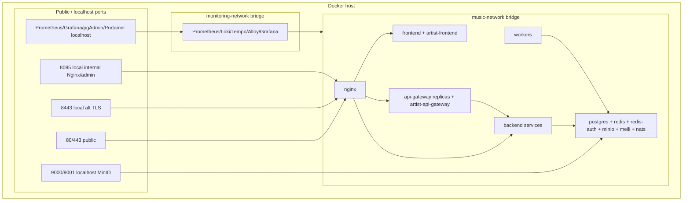

### Optional PgBouncer overlay

When `docker-compose.pgbouncer.yml` is applied:

- **Added service:** `pgbouncer` exposes `6432` only on `music-network`.
- **Database target changes:** selected high-traffic services use `DB_HOST=pgbouncer`, `DB_PORT=6432`.
- **Pool mode:** default `transaction`; services that rely on prepared statements disable DB prepare where needed.
- **Affected services:** `database-service`, `upload-service`, `artist-service`, `recommendations-service`, `playlist-service`, `lyrics-service`, `subscription-service`, `direct-stream-service`.

## Карта 22: Production read model

- **External clients:** only browser/PWA/artist browser should touch public domains.
- **Edge:** Nginx is the only public ingress for app services.
- **Gateways:** all business APIs pass through `api-gateway` or `artist-api-gateway`.
- **Internal network:** backend services, stores and workers communicate over `music-network`.
- **Storage:** MinIO, Postgres, Redis, Meilisearch and NATS are not direct public APIs for product clients.
- **Workers:** processing/recommendation/transcode workers are event/poll-driven and do not expose user-facing APIs.
- **Observability:** monitoring/admin surfaces are localhost-bound and should be accessed only through controlled operator channels.

## Карта 23: Product capability map

| Product / capability | Frontend entry | API surface | Primary backend/services | Data plane |
|---|---|---|---|---|
| Home player | `/` → `MusicPlayer` | `/api/songs/*`, `/api/recommendations/*`, stream session endpoints | `database-service`, `recommendations-service`, `direct-stream-service`, `ebap-hls-adapter` | Postgres, Redis, MinIO |
| Search | `/search` | `/api/search/v1/*`, fallback catalog APIs | `search-service`, `database-service` | Meilisearch, Postgres |
| Public artist pages | `/artist/:artist`, `/artist/:artist/tracks`, `/artists/popular` | `/api/artists/*` | `artist-service` | Postgres |
| Albums | `/album/:albumPublicId`, `/album/:artist/:albumName` | `/api/albums/*`, song/catalog APIs | `artist-service`, `database-service` | Postgres |
| Public playlist/share | `/playlist/:idOrToken`, `/p/:slug`, `/mix/:token` | `/api/playlists/*`, `/api/mix/*` | `playlist-service`, `database-service` | Postgres, Redis |
| User profile/account | `/profile`, `/account/:id` | `/api/profile`, `/api/user/*`, avatar/offline APIs | `auth-service`, `database-service`, `upload-service` | Postgres, Redis auth, MinIO |
| Subscriptions | `/subscription` | `/api/subscriptions/*` | `subscription-service` | Postgres |
| Mood Radar | `/mood-radar` | recommendation/catalog/feedback APIs | `recommendations-service`, `ranking-service`, reco workers | Postgres, Redis |
| Likes/dislikes/EQ | player/profile actions | `/api/likes/*`, `/api/dislikes/*`, `/api/eq/*` | `upload-service`, `database-service` | Postgres |
| Direct playback | `PlaybackConnector` / `DirectSession` | `/api/stream/v2/*`, `/audio/v1/*` | `direct-stream-service`, `transcode-worker` | Postgres, Redis, MinIO |
| HLS playback | `HlsSession` | `/api/ebap-hls/*` | `ebap-hls-adapter`, EBAP workers, `lyrics-service` | Postgres, Redis, MinIO |
| Lyrics | player lyrics UI | `/api/lyrics/*`, HLS lyrics binary | `lyrics-service`, `ebap-hls-adapter` | Postgres |
| Party | Party drawer/modal/page integrations | `/api/party/*`, `/ws/v2` | `party-state-service`, `party-gateway-service` | Redis DB2, NATS |
| Device Sync | device controls/provider | `/api/devices/*`, `/ws/devices` | `device-sync-service` | Redis DB3 |
| Auth domain | `auth.earflow.ru/login` | `/api/auth/*`, `/api/profile`, `/api/verify` | `auth-service`, `security-service` | Redis auth, Postgres |
| PWA/offline shell | service worker, profile offline controls | shell assets, offline/profile APIs | frontend service worker, `database-service`, `upload-service` | Browser cache, Postgres, MinIO |
| Artist login/signup | artists `/login`, `/signup` | artist `/api/auth/*` | `artist-api-gateway`, `auth-service` | Redis auth, Postgres |
| Artist onboarding/claims | artists `/onboarding`, `/admin/claims` | `/api/artists/claims`, `/api/artists/admin` | `artist-service` | Postgres |
| Artist card management | artists `/manage` | `/api/artist-portal/*`, `/api/artists/*` | `artist-portal-service`, `artist-service`, `security-service` | Postgres, Redis auth |
| Artist track management | artists `/tracks` | `/api/artist-portal/tracks*`, upload APIs | `artist-portal-service`, `upload-service`, media workers | Postgres, MinIO |
| Artist security/MFA | artists `/security`, `/security/2fa` | `/api/auth/security/*`, `/api/auth/2fa/*` | `security-service`, `auth-service` | Redis auth, Postgres |
| Ops dashboards | localhost tools | `/metrics`, Prometheus/Loki/Grafana/Portainer/pgAdmin | Nginx, gateway, monitoring stack, tools profile | Prometheus TSDB, Loki, Tempo, Docker API |

## Карта 24: Security and reliability risk assessment

### Executive summary

| Area | Status | Risk level | Notes |
|---|---|---:|---|
| Public ingress | Mostly strong | Medium | Nginx is the only public ingress for app traffic. Admin/metrics and tool UIs are localhost-bound. Upload paths need explicit per-route body/time limits on every upload-capable host. |
| Gateway identity boundary | Strong | Low | `InternalHeaderSanitizer` removes client-supplied `X-User-Id`, `X-User-Role`, `X-Service-Token`, correlation and upload-context headers before session middleware and routing. |
| Session and CSRF | Strong but complex | Medium | Go gateway uses SID + HMAC CSRF and origin checks. Node upload/artist services also have CSRF middleware. Cross-domain main/artist fallback cookies increase operational complexity. |
| Service-to-service auth | Strong | Medium | Database service issues RS256 service JWTs and validates issuer/audience. Availability depends on DB service token endpoint and key rotation discipline. |
| Redis dependency | Critical dependency | High | `redis-auth` stores sessions, CSRF/step-up state and security metadata. `redis` backs cache/rate-limit/realtime. Outage degrades login/session, gateway rate-limits and realtime behavior. |
| Artist Portal write plane | Fixed / watch | Medium | Backend now enforces MFA enabled + active step-up for write/upload/publish/delete flows. Production cannot disable track upload step-up through env flag. |
| Streaming data plane | Strong but sensitive | Medium | Direct stream requires gateway-issued user context for sessions, then signed query or HttpOnly stream cookie for `/audio/v1/*`. MinIO redirect paths must remain internal-only. |
| Upload/transcode pipeline | Operationally sensitive | High | Large files, temp disk buffering, ffmpeg, MinIO and async workers create backpressure risk. Timeouts, queue visibility and disk/tmp sizing are critical. |

### Confirmed protective controls

| Control | Evidence | Why it matters |
|---|---|---|
| Client identity header stripping | `go-api-gateway/internal/httpx/middleware/headers.go` removes `X-User-Id`, `x-user-id`, `X-User-Role`, `X-Service-Token`, `X-Earflow-Upload-Context` before routing. | Prevents direct user/admin/service impersonation through spoofed public request headers. |
| Gateway session auth before route policy | `internal/app/server.go` orders `InternalHeaderSanitizer` before `SessionAuthMiddleware`, then route policy enforcement. | `require_user` routes receive user headers only after session verification. |
| CSRF on unsafe routes | `go-api-gateway/internal/proxy/reverse_proxy.go` enforces route trust class; `SessionManager.EnforceCSRF` validates origin and HMAC-bound CSRF token. | Protects cookie-authenticated unsafe operations from cross-site form/fetch abuse. |
| Service token signing | `database-service` validates service keys with timing-safe compare and issues RS256 JWTs with issuer/audience; service consumers use `X-Service-Token`. | Reduces trust in raw shared keys on every DB API call and centralizes service auth. |
| Direct audio authorization | `direct-stream-service` authorizes session creation using `X-User-Id`, then serves `/audio/v1/*` only with valid signed query or stream cookie. | Prevents unauthenticated direct object access even when stable audio URLs are known. |
| Private storage ports | Compose keeps PostgreSQL/Redis internal and binds MinIO/ops tooling to `127.0.0.1`. | Reduces blast radius from database/cache/object-store admin surfaces. |
| Artist upload context sanitization | Public gateway strips inbound `X-Earflow-Upload-Context`; Artist Portal service adds it when proxying to upload-service. | Prevents public clients from pretending to be the Artist Portal for restricted song mutations. |

### Confirmed fixes from this assessment

| Fix | File | Impact |
|---|---|---|
| Enforced backend MFA + step-up for Artist Portal writes. | `backend/artist-portal-service/server.js` | `ensureMfaStepUpForWrite` now checks artist/admin access, `/api/auth/2fa/status`, and `/api/auth/2fa/step-up/status`; write/upload/publish/delete routes no longer rely only on frontend guards. |
| Disabled production bypass for track upload step-up. | `backend/artist-portal-service/server.js` | `ARTIST_PORTAL_DISABLE_TRACK_UPLOAD_STEP_UP` can only bypass in non-production. |
| Raised artist portal upload edge body size. | `nginx/nginx.conf` | `artists.earflow.ru` `/api/artist-portal/` now explicitly accepts uploads up to `250M`, matching the `200MB` track upload proxy envelope. |
| Aligned Artist Portal upload timeout budget. | `nginx/nginx.conf`, `backend/go-api-gateway/gateway.artist.yaml` | Artist track uploads use a dedicated gateway route with `180s` timeout and Nginx artist portal proxy read/send timeout is `180s`; request buffering is disabled at the edge for the artist portal API path. |
| Removed large in-memory Artist Portal track buffering. | `backend/artist-portal-service/server.js`, `backend/artist-portal-service/routes/tracks.js` | Artist track uploads now use disk-backed temporary files and guaranteed cleanup before forwarding to upload-service, instead of holding up to `200MB` in process memory. |
| Added gateway internal-header sanitizer regression test. | `backend/go-api-gateway/internal/httpx/middleware/headers_test.go` | Spoofed `X-User-Id`, `X-User-Role`, `X-Service-Token`, `X-Internal-Token`, correlation and artist upload-context headers must be stripped before downstream middleware/routes see the request. |

### High-priority risks and failure modes

| Risk | Severity | Failure mode | Recommended action |
|---|---:|---|---|
| `redis-auth` outage or noeviction memory exhaustion | High | Existing sessions cannot be read/refreshed; MFA step-up disappears; auth/security endpoints return 503; rate of forced re-login spikes. | Add Redis auth memory alerts, persistence backup checks, failover plan, session TTL dashboards, and explicit runbook for `noeviction` pressure. |
| Upload/transcode backpressure | High | Artist uploads now avoid large in-process buffers, but temp disk, upload-service ffmpeg/tmp/MinIO/transcode queues can still stall; users see 413/502/timeout or tracks stuck pending. | Monitor temp disk usage, upload latency/status and transcode backlog; align Nginx/gateway/service upload timeouts. |
| Cross-domain cookie coupling | High | Main and artist session fallback cookies allow smoother SSO but increase blast radius from session confusion, logout edge cases, and CSRF token namespace mistakes. | Decide explicit policy: either keep fallback as intentional SSO and test it, or isolate artist auth strictly to `mp_*_artists` cookies. Document cookie domain/SameSite/CSRF invariants. |
| Service-token endpoint dependency | High | Gateway/database-dependent routes fail with `SERVICE_TOKEN_UNAVAILABLE` if database-service token issuer is unhealthy or service key/env is missing. | Add startup validation for all service keys, token issuer health alerts, cached-token expiry metrics, and rotation runbook for RS256 keypair + service keys. |
| MinIO presigned internal redirect exposure | High | If `/media/direct-audio*` internal paths or MinIO S3 API become publicly reachable, signed object URLs could bypass application checks. | Keep `internal` Nginx locations and localhost-only MinIO bindings; add deployment tests that public `/media/direct-audio*` direct access is denied without gateway-generated redirect. |

### Medium-priority risks and failure modes

| Risk | Severity | Failure mode | Recommended action |
|---|---:|---|---|
| Gateway transport has no global response header timeout | Medium | Long-lived websocket support requires `ResponseHeaderTimeout=0`; a misbehaving non-WS upstream can hold gateway resources until route context timeout or server limits apply. | Ensure every non-websocket route has an explicit YAML `timeout`; add config lint that fails if unsafe/public API routes omit timeouts. |
| Artist Portal upload timeout mismatch | Controlled | Artist Portal proxies song upload with `120s`; Nginx and artist gateway now allow `180s` for the upload path. | Keep staging upload checks for 50-200MB files and monitor timeout/413/502 rate after deploy. |
| CSRF logic split across gateway and Node services | Medium | Gateway and services both implement CSRF rules with slightly different cookie-name assumptions and bearer bypass semantics. | Keep gateway as primary browser CSRF authority; add integration tests for main upload, artist upload, bearer-only API calls, and missing/bad Origin cases. |
| Redis rate limiter fail-closed | Medium | Gateway limiter returns 503 when Redis rate-limit backend errors. This protects abuse but can turn Redis degradation into broad API outage. | Decide per-route fail-open/fail-closed policy; keep auth/upload fail-closed, consider controlled fail-open for low-risk read endpoints. |
| Public catalog cache invalidation | Medium | Gateway response cache is invalidated by namespace after unsafe writes; missed namespace mapping can serve stale catalog/playlist data. | Add cache namespace tests for publish/unpublish/playlist mutations and expose cache hit/miss/invalidation metrics. |
| EBAP/HLS adapter and direct stream dual stack | Medium | Two streaming paths mean two token/cookie/MinIO/cache policies. Drift can break iOS only or direct playback only. | Keep shared security checklist for stream session auth, signed asset access, cache headers, and fallback behavior. |

### Low-priority or currently controlled risks

| Risk | Current control | Residual concern |
|---|---|---|
| Direct spoofing of `X-User-Id` / `X-Service-Token` | Gateway `InternalHeaderSanitizer` strips these headers before auth. | Must stay before all auth/routing middleware; add regression test for ordering. |
| Public database/cache exposure | Compose does not expose Postgres/Redis publicly; MinIO and tools are localhost-bound. | Production firewall should still enforce this outside Docker. |
| Upload context spoofing | Gateway strips inbound `X-Earflow-Upload-Context`; only Artist Portal service sets it internally. | Direct internal network access to upload-service would still bypass edge sanitization; keep services on trusted Docker network only. |
| Direct browser navigation to audio links | Direct stream blocks likely direct-link navigation and requires token/cookie. | Browser heuristics can vary; keep tests for media element playback versus top-level navigation. |

### Priority action plan

1. **P0:** Keep Artist Portal backend MFA/step-up enforcement; add tests for upload/edit/delete/publish without MFA, without step-up and with valid step-up.
2. **Done:** Gateway middleware regression test proves spoofed `X-User-Id`, `X-User-Role`, `X-Service-Token` and `X-Earflow-Upload-Context` are stripped before route policy checks.
3. **Done / watch:** Artist track upload limits/timeouts are aligned across `nginx`, `artist-api-gateway` and `artist-portal-service`; keep staging checks for large uploads and worker queues.
4. **P1:** Add Redis-auth operational alerts: memory, evictions, AOF errors, latency, connected clients, step-up/session key counts.
5. **P1:** Add service-token issuer health and cached-token expiry metrics for gateways and internal services.
6. **P2:** Decide and document final main-vs-artist cookie isolation policy.
7. **P2:** Add deployment smoke tests for localhost-only ops ports, internal MinIO redirect paths and public media access denial.

## Open verification notes

- **Line-level endpoints:** gateway route tables are authoritative for exact method/path/policy; this document groups them by product surface.
- **Environment-specific URLs:** runtime frontend config can override API/streaming base URLs; production defaults should remain API-gateway centered.
- **Legacy folders:** folders may exist for deprecated systems; active runtime status is determined by compose + Nginx + gateway routes.
